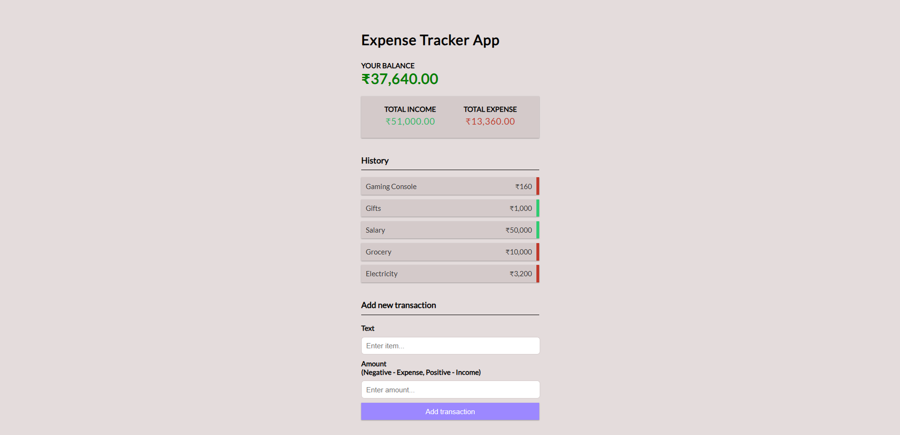

# 💸 Expense Tracker App

#### Effortlessly manage your personal finances with this full-stack MERN (MongoDB, Express, React, Node.js) application.
#### Track income, expenses, and savings in real-time with detailed transaction history and seamless CRUD operations.

## 🚀 Live Demo
### [Click here!](https://google.com/)

## 📸 Screenshot


## 🛠️ Tech Stack
- **Frontend:** React.js
- **Backend:** Node.js, Express.js
- **Database:** MongoDB (Mongoose)
- **State Management:** React Context API + useReducer
- **Styling:** CSS

## Features
- 📈 **Real-Time Balance Tracking** — Instantly view your current financial standing.
- 📝 **Full CRUD Operations** — Create, Read, Update, and Delete transactions.
- 🧮 **Income & Expense Summary** — Separate visualization of total income vs expenses.
- 🔍 **Transaction History** — See detailed logs of every entry.
- 🚀 **Responsive Design** — Works perfectly across devices (desktop, tablet, mobile).
- 🌐 **RESTful APIs** — Backend built using Express.js following best REST practices.
- 🔒 **Environment Configuration** — Secrets managed securely with ```.env``` variables.

## 📢 Future Improvements
- 📊 Add visual charts (income vs expense graphs)
- 🔐 Add user authentication (JWT)
- 🌎 Multi-currency support

## 👨‍💻 Author
### Piyush Verma
#### [GitHub Profile](https://github.com/piyushverma2001)

## ❤️ Support
If you find this project helpful, feel free to give it a ⭐ on GitHub!
Pull requests are welcome!
